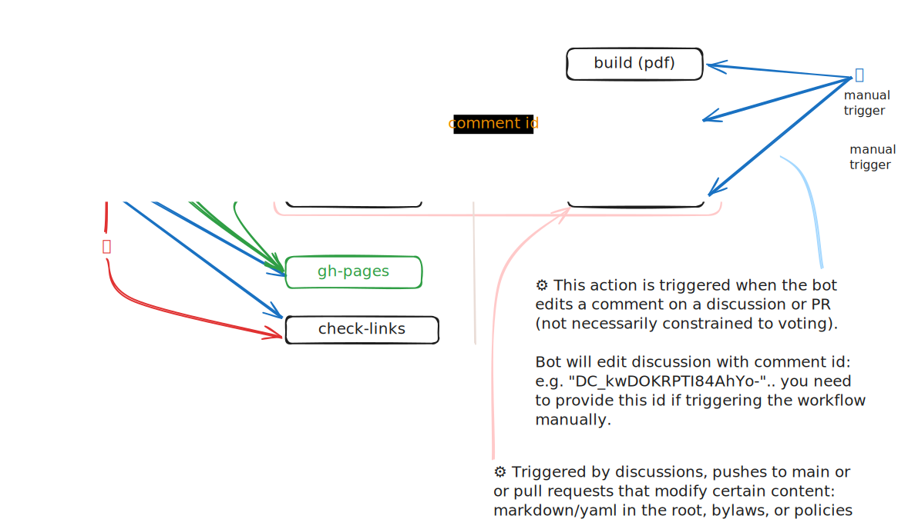

# Contributing to Commonhaus Foundation Website

We appreciate your interest in contributing to our project! This document provides some basic guidelines for contributing.

## Legal

This website's content (excluding generated content and content sourced in repositories with other licenses) is licensed under the Creative Commons Attribution-ShareAlike 4.0 International License (CC BY-SA 4.0). 

All contributions are subject to the [Developer Certificate of Origin (DCO)](https://developercertificate.org/). The DCO text is also included verbatim in the [dco.txt](dco.txt) file in the root directory of the repository.

## Deno, Lume and Vento

This project uses [Deno](https://deno.land/) as the runtime, the [Lume static site generator](https://lume.land/) and [Vento templating engine](https://vento.js.org/).

## Setup

1. **Checkout this repository and all recursive submodules**

    You can do this by running the following command:

    ```bash
    git clone --recursive <https://github.com/commonhaus/commonhaus.github.io.git>
    ```

2. **Install Deno**

   Install it by following the instructions on the [Deno website](https://deno.land/#installation).

3. **Install the GH CLI** (optional)

    Content generation uses the [GitHub CLI](https://cli.github.com/) for GraphQL queries. If you want to use the tasks that pull new content, you'll need the GH CLI.

4. **Serve the website**

    You can serve the website locally by running the following command:

    ```bash
    deno task serve
    ```

    Other tasks are available (in `deno.json`, list with `deno task`):

    - `build`: Builds the website (first Lume, then Vite+Svelte)
    - **Lume**
        - `debug`: Allows you to attach a debugger to a deno task.
        - `serve`: Builds and serves the website, and watch for changes. Membership UI requires a backing service (see [cf-admin-bot](https://github.com/commonhaus/automation))
        - `serve-all`: Builds and serves the website, and watch for changes. Provides a mock backend for the Membership UI
    - **Generation** (requires the GH CLI)
        - `about`: Update metadata about members of the foundation based on the CONTACTS list.
        - `activity`: Query the latest discussions and PRs from the foundation repository and update corresponding site pages.
        - `lastmod`: update information about the contents of the foundation submodule.
        - `votes`: Update metadata related to a vote (discussion or PR)
    - **Verification**
        - `checklocal`: test links against a running local server.
        - `checklinks`: check for invalid links

## Project Structure

- `.github` - build scripts
- `member` - Svelte-based Membership UI. Requires a backend
- `site` - source
    - `_data` - data shared by / available to all pages
        - `bylaws.yml` - sidebar TOC for bylaws (manual)
        - `menu.yml` - site navigation menu (manual)
        - `metas.yml` - default metadata configuration
        - `svg.yml` - common/reusable svg
    - `_generated` - Foundation submodule metadata
        - `activity/<number>.json` - PRs and Discussion content as json files
        - `votes/<repo>/<item>.json` - vote results as json files
        - `about.yml` - maintained by `.github/about.ts`
        - `authors.yml` - maintained by `.github/activity.ts`
        - `foundation.json` - generated metadata (from git) for files in the foundation submodule
        - `foundation.yml` - metadata sidecar for files that should be rendered on the website (SEO descriptions, specific URL assignments, etc.)
    - `_includes` - rendering artifacts
        - `layouts` - content layout templates
        - `scss` - sass css fragments
    - `about` - "About the foundation"
        - `_data.ts` - Dynamic metadata based on merging generated sources (see below)
        - `index.md` - About Us landing page
        - `branding.md` - Branding guidelines
        - `codehaus.md` - Codehaus legacy
        - Other content from the foundation repo is placed into this section by `site/_plugins/foundationData.ts`
    - `activity` - Generated pages for discussions and PRs.
        - `_data.yaml` - Common/default metadata for all pages in this section
        - `announcements.md` - Filtered view of announcements
        - `index.md` - Landing page (overview of all activity)
        - `index.page.js` - Generate pages from `site/_generated/activity/*.json`
        - `notices.md` - Filtered view of notices
    - `assets` - static source files (processed by Lume)
        - `svg` the svg icon files in this folder are combined into a single sprite by SVGSpriter in `index.page.js`
    - `community` - empty directory. The landing page for this section is `foundation/COMMUNICATION.md` (See `site/_generated/foundation.yml`)
    - `foundation` - git submodule. Contains bylaws, policies, and other governance documents.
        - Canonical sources: CONTACTS.yaml, PROJECTS.yaml, etc.
        - See  `site/_plugins/foundationData.ts`
    - `static` - static files (copied to output directory)
    - `votes` - vote result summaries
        - `index.page.js` - parses all json files in `site/_generated/votes`, and creates a page and an svg for each vote result.
- `_config.ts` - Lume site config (static site generation)
- `deno.json` - Deno dependency and task configuration (akin to package.json)
- `vite.config.mjs` - Vite configuration used to build the Svelte files for the Membership UI

### Weird things



- **Foundation submodule**
    - Content from the [commonhaus/foundation](https://github.com/commonhaus/foundation) repository is the canonical source for most site content.
    - `.github/lastmod.ts` updates `site/_generated/foundation.json` with the git-derived metadata for "interesting" files (`.md` and `.yaml`) from that repository
    - Workflows: `.github/workflows/push-content.yml`
- **About pages**
    - `site/foundation/CONTACTS.yaml` and `site/foundation/PROJECTS.yaml` are the authoritative sources for the project list and the about page.
    - `.github/about.ts` queries GitHub for the latest bio / profile pictures for committee members.
    - Data transformation: `.github/about.ts` updates `site/_data/about.yml`, which is used by `site/about/_data.ts` to provide data to `site/about/index.md`
    - Workflows: `.github/workflows/push-content.yml` and `.github/workflows/update-metadata.yml`
- **Foundation pages** (`site/foundation/**`) have to render properly in both the original repository (and in pdfs) and on the website. That means, some weirdness.
    - **Content**
        - `site/_generated/foundation.json` contains git-derived file information
        - `site/_generated/foundation.yml` is hand-tended to specify the pages from the foundation repository that should be included in the website (and to specify the URL they should use and provide a meta description, etc.).
    - **Rendering**
        - `plugins/foundationData.ts` defines html and markdown preprocessors to merge content metadata with lume page definitions
        - `site/_includes/layouts/bylaws.vto` and `site/_includes/layouts/foundation.vto` both assume the content already contains the h1/title (which these pages do).
        - `site/_includes/layouts/bylaws.vto` defines a navigation sidebar for bylaws and policies.
- **Activities** (`activity`) are generated from the content of GH Discussions, Pull Requests, and Issues.
    - `site/_generated/activity/*.json` files are generated from PRs/Issues/Discussions by `.github/activity.ts`
    - `site/activity/index.page.js` turns those json files into pages
    - `./site/_generated/authors.yml` is updated with information about the author of each item.
    - `site/_includes/layouts/activity.vto` uses `site/_includes/layouts/activitySidebar.vto` to define a sidebar for individual activity pages (Announcement vs. Notices)
    - `site/_includes/layouts/activityArchive.vto` defines an archive page listing all activities grouped by date. See `site/activity/announcements.md` and `site/activity/notices.md`
    - `site/_includes/layouts/activityOverview.vto` defines the activity overview page, showing the most recent Announcements, Notices, and Votes. See `site/activity/index.md`.
    - Workflows: `.github/workflows/push-content.yml`
- **Vote result summaries** (`votes`)
    - `site/_generated/votes/**/*.json` files are generated from PRs/Issues/Discussions by `.github/votes.ts`
    - `site/votes/index.page.js` turns those json files into pages and svg assets
    - `site/_includes/layouts/activityVote.vto` uses `site/_includes/layouts/activitySidebar.vto` to define a sidebar for individual activity pages.
    - `site/_includes/layouts/activityVoteArchive.vto` provides an archive page listing all vote results
    - Workflows: `.github/workflows/push-votes.yml`
- **Membership UI** (`member/*`)
    This is a separate/follow-on build for a single-page application (SPA) built with Svelte. It uses one of the automation bots as a backend to maintain user data (membership application, email alias management, and form-signing).

## Contributing

Once you've set up the project, you're ready to start contributing! Please make sure to read and follow our [Code of Conduct](https://github.com/commonhaus/foundation/?tab=coc-ov-file#readme).

If you're fixing a bug or implementing a feature, please create a branch and submit a pull request. If you're not sure where to start, take a look at the [issues](https://github.com/commonhaus/commonhaus.github.io/issues) in this repository.

Thank you for your contribution!
