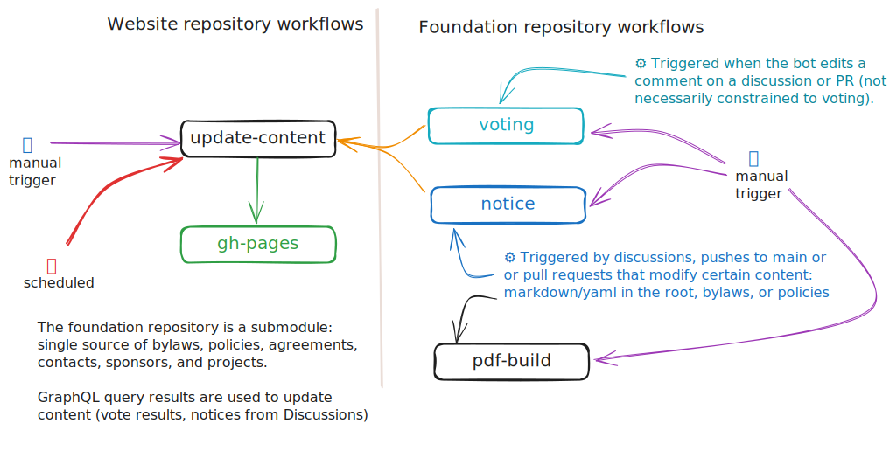

# Contributing to Commonhaus Foundation Website

We appreciate your interest in contributing to our project! This document provides some basic guidelines for contributing.

## Legal

This website's content (excluding generated content and content sourced in repositories with other licenses) is licensed under the Creative Commons Attribution-ShareAlike 4.0 International License (CC BY-SA 4.0). 

All contributions are subject to the [Developer Certificate of Origin (DCO)](https://developercertificate.org/). The DCO text is also included verbatim in the [dco.txt](dco.txt) file in the root directory of the repository.

## Deno, Lume and Vento

This project uses [Deno](https://deno.land/) as the runtime, the [Lume static site generator](https://lume.land/) and [Vento templating engine](https://vento.js.org/).

## Setup

1. **Checkout this repository and all recursive submodules**

    You can do this by running the following command:

    ```bash
    git clone --recursive <https://github.com/commonhaus/commonhaus.github.io.git>
    ```

2. **Install Deno**

   Install it by following the instructions on the [Deno website](https://deno.land/#installation).

3. **Install the GH CLI** (optional)

    Content generation uses the [GitHub CLI](https://cli.github.com/) for GraphQL queries. If you want to use the tasks that pull new content, you'll need the GH CLI.

4. **Serve the website**

    You can serve the website locally by running the following command:

    ```bash
    deno task serve
    ```

    Other tasks are available (in `deno.json`, list with `deno task`):

    - `build`: Builds the website (first Lume, then Vite+Svelte)
    - **Lume**
        - `attach`: Allows you to attach a debugger to a deno task.
        - `serve`: Builds and serves the website, and watch for changes. Membership UI requires a backing service (see [cf-admin-bot](https://github.com/commonhaus/automation))
        - `serve-all`: Builds and serves the website, and watch for changes. Provides a mock backend for the Membership UI
    - **Generation** (requires the GH CLI)
        - `about`: Update metadata about members of the foundation based on the CONTACTS list.
        - `activity`: Query the latest discussions and PRs from the foundation repository and update corresponding site pages.
        - `lastmod`: update information about the contents of the foundation submodule.
        - `checkCsp`: Recompute CSP hashes (see the [CSP header in the base layout](site/_includes/layouts/base.vto))

## Content Generation Architecture

The website combines content from multiple sources through several transformation steps, as illustrated in the diagram below:



### Data Flow Components

- **Foundation Submodule**: Content from the [commonhaus/foundation](https://github.com/commonhaus/foundation) repository is the canonical source for most site content
- **About Pages**: Generated from authoritative YAML files combined with GitHub profile data
- **Foundation Pages**: Special handling to ensure content renders properly in multiple contexts
- **Activities**: Generated from GitHub Discussions, PRs, and Issues
- **Vote Summaries**: Generated from voting activity in GitHub repositories
- **Membership UI**: Single-page Svelte application with backend integration

### Content structure:

- `foundation-content` - *git submodule*.  
    Contains bylaws, policies, and other governance documents.
    - Canonical sources: CONTACTS.yaml, PROJECTS.yaml, etc.
    - Content processed and published by `site/foundation.page.ts` and 
    - 👤 Map of foundaton content to URL is in `site/_foundation.yml`
    - The `site/_plugins/foundationPages.ts` plugin manages logo import/caching, URL fixing, and other rendering functions
- `member` - Svelte-based Membership UI. Requires a backend
- `site` - Root for Deno/Lume static content
    - `_data` - data shared by / available to all pages
        - `menu.yml` - 👤 site navigation menu (manual updates)
        - `metas.yml` - default metadata configuration
        - `svg.yml` - common/reusable svg sprites
    - `_generated` - Generated data
        - `activity/<number>.json` - 🤖 👷 PRs and Discussion content as json files (`tasks/activity.ts`)
        - `votes/<repo>/<item>.json` - 🤖 👷 Vote results as json files (shared workflow: [commonhaus/vote-record-actions](https://github.com/commonhaus/vote-record-actions))
        - `about.yml` - 🤖 👷 public committee/member metadata (`tasks/about.ts`)
        - `authors.yml` - 🤖 👷 public author metadata (`tasks/activity.ts`)
        - `foundation.json` - 🤖 👷 generated metadata (from git) for files in the foundation submodule  (`tasks/lastmod.ts`)
        - `foundation.yml` - 👤 metadata sidecar for files that should be rendered on the website (SEO descriptions, specific URL assignments, etc.)
    - `_includes` - rendering artifacts
        - `layouts` - content layout templates
        - `scss` - sass css fragments
    - `_plugins` - Custom plugins for augmenting and rendering content
    - `about` - "About the foundation"
        - `_data.ts` - Dynamic metadata based on merging generated sources (see below)
        - `index.md` - About Us landing page (cfc, egc, members)
        - `branding.md` - Branding guidelines
        - `codehaus.md` - Codehaus legacy
        - Other content is placed into this section by `site/_plugins/foundationPages.ts`
    - `activity` - Generated pages for discussions and PRs.
        - `_data.yml` - Common/default metadata for all pages in this section
        - `announcements.md` - Filtered view of announcements
        - `index.md` - Landing page (overview of all activity)
        - `index.page.js` - Generate pages from `site/_generated/activity/*.json`
        - `notices.md` - Filtered view of notices
    - `assets` - static source files (processed by Lume)
        - `svg` the svg icon files in this folder are combined into a single sprite by SVGSpriter in `index.page.js`
    - `bylaws` - location of bylaws (mostly generated)
        - `_data_.yml` - 👤 sidebar TOC for bylaws (manual updates)
    - `community`
        - The landing page for this section is `foundation/COMMUNITY.md` (See `site/_foundation.yml`)
        - `discord.md` common landing page to direct folks to our discord server
    - `member`: placeholder location for member UI
    - `policies`:
        - `_data`: additional attributes for rendering policies
    - `static` - static files (copied to output directory)
    - `votes` - vote result summaries
        - `index.page.js` - parses json files in `site/_generated/votes`, and creates a page and an svg for each vote result.
- `tasks` - 👷 Build scripts
- `_config.ts` - Lume site config (static site generation)
- `deno.json` - Deno dependency and task configuration (akin to package.json)
- `vite.config.mjs` - Vite configuration used to build the Svelte files for the Membership UI

## Contributing

Once you've set up the project, you're ready to start contributing! Please make sure to read and follow our [Code of Conduct](https://github.com/commonhaus/foundation/?tab=coc-ov-file#readme).

If you're fixing a bug or implementing a feature, please create a branch and submit a pull request. If you're not sure where to start, take a look at the [issues](https://github.com/commonhaus/commonhaus.github.io/issues) in this repository.

Thank you for your contribution!
